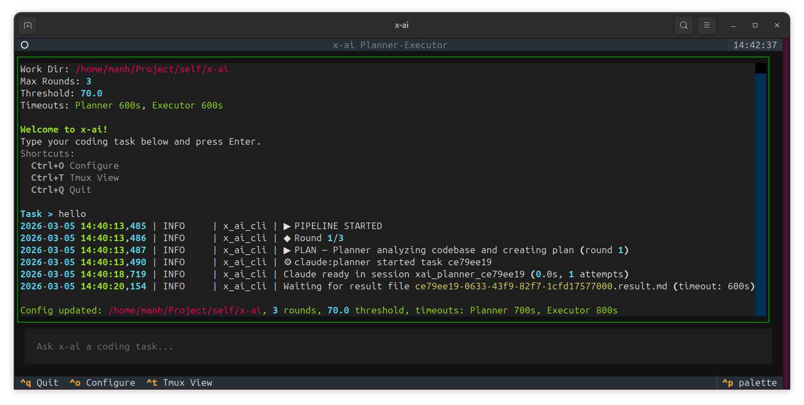
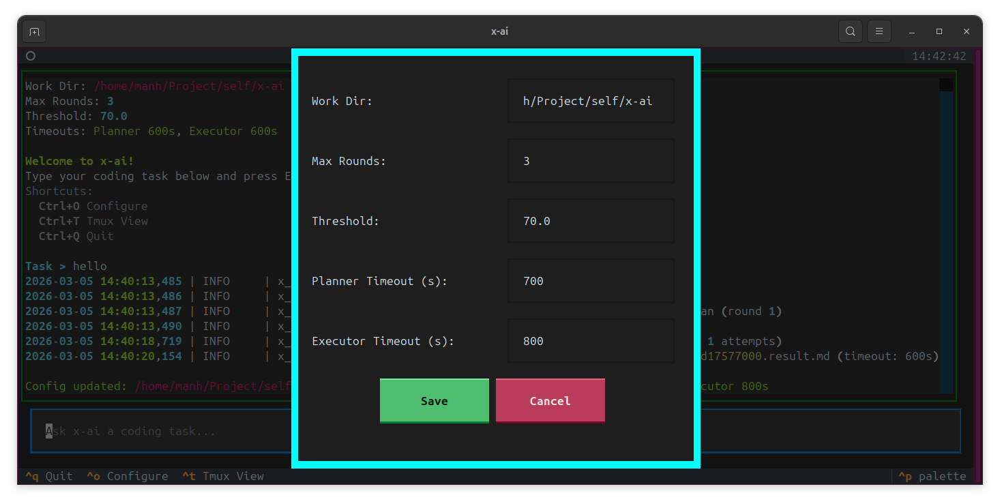
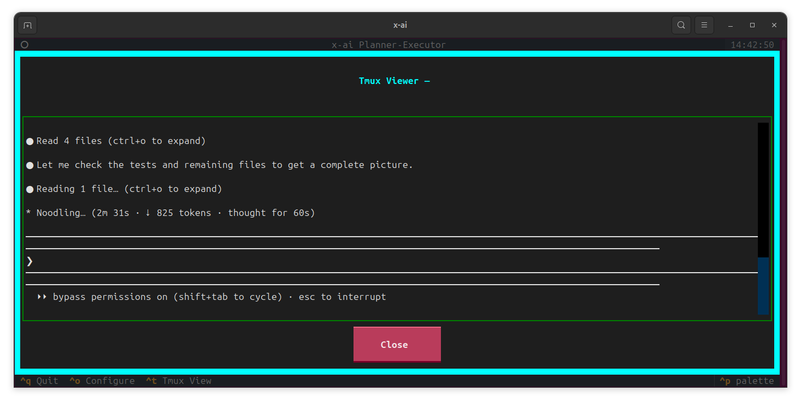

# x-ai

**Multi-Agent AI Coding System** — An orchestrator that coordinates two specialized AI agents (Planner and Executor) to autonomously analyze codebases, plan changes, implement code, and self-review with iterative quality improvement.

[](https://pypi.org/project/x-ai-orchestrator/)
[](https://pypi.org/project/x-ai-orchestrator/)
[](LICENSE)

## Table of Contents

- [What Problem Does x-ai Solve?](#what-problem-does-x-ai-solve)
- [Architecture](#architecture)
- [Installation](#installation)
- [Usage](#usage)
- [Development](#development)
- [License](#license)

## What Problem Does x-ai Solve?

Coding with AI assistants today is a single-agent experience — you give one AI a prompt and hope it gets everything right on the first try. For complex tasks, this often fails because:

- **No planning phase** — The AI jumps straight into coding without analyzing the codebase
- **No self-review** — There's no quality gate; mistakes ship as-is
- **No iterative improvement** — If the result is poor, you manually re-prompt

**x-ai solves this** by splitting the work between two specialized agents with a feedback loop:

| Agent        | Role                                                                                                          |
| ------------ | ------------------------------------------------------------------------------------------------------------- |
| **Planner**  | Reads the codebase, identifies relevant files, creates a detailed implementation plan with verification steps |
| **Executor** | Follows the plan step-by-step, writes code, runs verification (format, lint, tests)                           |

After execution, the Planner **reviews** the Executor's changes, scores them on 5 dimensions, and provides feedback. If the score is below a threshold, the loop repeats with the feedback incorporated — automatically, without human intervention.

```
User Request
     │
     ▼
┌─────────┐     ┌──────────┐     ┌─────────┐
│  PLAN   │────▶│ EXECUTE  │────▶│ REVIEW  │
│(Planner)│     │(Executor)│     │(Planner)│
└─────────┘     └──────────┘     └────┬────┘
     ▲                                │
     │         score < threshold      │
     └────────── feedback ────────────┘
                                      │
                           score >= threshold
                                      │
                                      ▼
                                  ✓ SUCCESS
```

## Architecture

### System Overview

```
x-ai/
├── x_ai_cli/                  # Core Python package
│   ├── main.py                # CLI entrypoint & argument parsing
│   ├── orchestrator.py        # Pipeline controller (PLAN → EXECUTE → REVIEW)
│   ├── agent_runner.py        # Tmux session management & Claude interaction
│   ├── models.py              # Data models (tasks, results, feedback)
│   ├── config.py              # Configuration & environment variables
│   ├── logger.py              # Rich console logging
│   ├── tui/                   # Textual-based interactive UI
│   │   ├── app.py             # Main TUI application (XAITui, Screens)
│   │   └── widgets.py         # Custom TUI components (ActionLog, etc.)
│   └── skills/                # Agent behavior definitions
│       ├── planner.md         # Planner agent skill (plan + review)
│       └── executor.md        # Executor agent skill (execute)
├── pyproject.toml
└── README.md
```

### Component Responsibilities

#### Orchestrator (`orchestrator.py`)

The central controller that manages the pipeline loop:

1. **PLAN phase** — Dispatches a `plan` task to the Planner agent with the user request
2. **EXECUTE phase** — Sends the Planner's implementation plan to the Executor agent
3. **REVIEW phase** — Asks the Planner to review the Executor's output and score it
4. **Quality gate** — If score ≥ threshold → success; otherwise build feedback and loop

#### Agent Runner (`agent_runner.py`)

Manages Claude CLI instances via **tmux sessions** with file-based communication:

- Creates detached tmux sessions and launches Claude inside them
- Handles startup prompts automatically (bypass permissions, trust folder)
- Writes task files (`.task.md`) and polls for result files (`.result.md`)
- Never reads Claude's output from tmux — all communication is through files on disk

#### Skills (`skills/`)

Markdown files that define each agent's behavior, communication protocol, and output format. These are injected as context when launching an agent.

- **`planner.md`** — Defines `plan` (analyze repo → create plan) and `review` (score code changes on 5 dimensions: correctness, code quality, security, performance, maintainability)
- **`executor.md`** — Defines `execute` (follow plan → implement code → run verification)

#### Models (`models.py`)

Dataclasses for structured communication between orchestrator and agents:

- `AgentTask` — Task file with YAML frontmatter (type, instructions, plan, feedback)
- `AgentResult` — Result file parsed from agent output (status, score, files changed)
- `ReviewResult` — Planner's review with score and notes
- `Feedback` — Structured feedback for retry rounds (mandatory fixes, score gaps, errors)

### Communication Protocol

All agent communication uses **Markdown files with YAML frontmatter**:

```markdown
---
id: "uuid-here"
type: "plan"
work_dir: "/path/to/project"
round: 1
feedback: null
---

## Instructions

Your task description here...
```

Agents read `.task.md` files and write `.result.md` files to the same directory.

### Scoring System

The Planner scores the Executor's work on 5 weighted dimensions:

| Dimension       | Weight | Description                            |
| --------------- | ------ | -------------------------------------- |
| Correctness     | 0.25   | Does the code meet requirements?       |
| Code Quality    | 0.20   | Readability, naming, structure, DRY    |
| Security        | 0.20   | Input validation, injection prevention |
| Performance     | 0.15   | Algorithmic efficiency, resource usage |
| Maintainability | 0.20   | Modularity, testability, documentation |

The weighted average becomes the round's score. If it meets the threshold (default: 70), the pipeline succeeds.

## Installation

### Prerequisites

- **Python 3.11+**
- **[Claude CLI](https://docs.anthropic.com/en/docs/claude-cli)** — installed and authenticated
- **tmux** — for managing agent sessions

### Install from PyPI

```bash
pip install x-ai-orchestrator
```

Or with [pipx](https://pipx.pypa.io/) (recommended — installs in isolated environment):

```bash
pipx install x-ai-orchestrator
```

After installation, the `x-ai` command is available globally:

```bash
x-ai --version
```

### Install from Source

```bash
git clone https://github.com/manhpham90vn/x-ai.git
cd x-ai
pip install .
```

## Usage

### Run Modes

x-ai can be run in two distinct modes depending on your workflow preferences.

#### 1. Interactive GUI Mode (TUI)

Launch the full-screen Textual interface to get complete insight into the execution process and provide prompts dynamically.

```bash
# Launch the interactive TUI (no arguments)
x-ai

# You can still pass configuration flags, e.g., to set the working directory
x-ai -d /path/to/project
```

#### 2. Single-shot CLI Mode

Provide the prompt directly inline to bypass the TUI entirely. This mode streams logs straight to standard output and is ideal for quick fixes or scripting.

```bash
# Run in single-shot mode with a coding task
x-ai "Add JWT authentication to the Flask API" -d /path/to/project

# Short form for single-shot mode
x-ai "Fix the login bug" -d ./my-app
```

### CLI Options

| Flag                 | Short | Default  | Description                                          |
| -------------------- | ----- | -------- | ---------------------------------------------------- |
| `prompt`             | —     | optional | The coding task to execute (omit for interactive UI) |
| `--work-dir`         | `-d`  | `.`      | Working directory for the target project             |
| `--max-rounds`       | `-r`  | `3`      | Maximum retry rounds before returning best-effort    |
| `--threshold`        | `-t`  | `70.0`   | Quality threshold score (0–100) to accept a solution |
| `--planner-timeout`  | —     | `600`    | Planner agent timeout in seconds                     |
| `--executor-timeout` | —     | `600`    | Executor agent timeout in seconds                    |
| `--verbose`          | `-v`  | `false`  | Enable debug-level logging                           |
| `--version`          | `-V`  | —        | Show version and exit                                |

### Examples

```bash
# Complex task with higher quality bar
x-ai "Refactor the database layer to use SQLAlchemy async sessions" \
  -d /path/to/project \
  --threshold 85 \
  --max-rounds 5

# Quick fix with lower threshold
x-ai "Fix typo in README" -d ./my-repo -t 50 -r 1

# Verbose mode for debugging
x-ai "Add unit tests for the auth module" -d ./api -v
```

### Environment Variables

All CLI options can also be set via environment variables:

| Variable                | Default  | Description                                  |
| ----------------------- | -------- | -------------------------------------------- |
| `XAI_CLAUDE_BIN`        | `claude` | Path to Claude CLI binary                    |
| `XAI_TMUX_BIN`          | `tmux`   | Path to tmux binary                          |
| `XAI_WORK_DIR`          | `.`      | Default working directory                    |
| `XAI_MAX_ROUNDS`        | `3`      | Maximum retry rounds                         |
| `XAI_QUALITY_THRESHOLD` | `70.0`   | Quality threshold score                      |
| `XAI_PLANNER_TIMEOUT`   | `600`    | Planner agent timeout (seconds)              |
| `XAI_EXECUTOR_TIMEOUT`  | `600`    | Executor agent timeout (seconds)             |
| `XAI_VERBOSE`           | `false`  | Enable verbose logging                       |
| `XAI_PROMPT_MARKER`     | `❯`      | Prompt marker for Claude readiness detection |
| `XAI_POLL_INTERVAL`     | `1.0`    | Filesystem polling interval (seconds)        |

### Interactive TUI







x-ai includes a rich, full-screen Terminal User Interface (TUI) built with [Textual](https://textual.textualize.io/). To launch it, simply run `x-ai` without any arguments.

**TUI Features:**

- **Real-time Logging:** View orchestrator events, Planner/Executor state changes, and task outcomes in a dynamic log panel.
- **Tmux Integration (`t`):** Press `t` to open a built-in viewer that shows the live, raw terminal output of the Claude agents running in their background tmux panes.
- **Settings Dialog (`c`):** Press `c` to configure pipeline settings (Threshold, Max Rounds, Working Directory) interactively before running a task.
- **Interactive Prompting:** Type your coding task directly into the TUI and press Enter to kick off the planner-executor pipeline.

### Single-Shot Output

x-ai also provides real-time progress via Rich console output when running a direct prompt:

```
╭──────────────────────────────────────────────╮
│ x-ai — Planner-Executor AI Coding System     │
│ v0.4.0                                       │
╰──────────────────────────────────────────────╯
Prompt: Add JWT authentication...
Work dir: /path/to/project
Max rounds: 3
Mode: Planner-Executor
Threshold: 70.0

◆ Round 1/3
▶ PLAN — Planner analyzing codebase and creating plan (round 1)
⚙ claude:planner started task a1b2c3d4
⚙ claude:planner finished a1b2c3d4 → success
▶ EXECUTE — Executor implementing code (round 1)
⚙ claude:executor started task e5f6g7h8
⚙ claude:executor finished e5f6g7h8 → success
Executor completed — 4 file(s) changed
▶ REVIEW — Planner reviewing code changes (round 1)
Planner score: 85.0 (threshold: 70.0) ✓ PASS
Score 85.0 >= threshold 70.0 — pipeline complete ✓

┌─────────────┬──────────────────────┐
│ Status      │ ✓ SUCCESS            │
│ Rounds Used │ 1                    │
│ Time        │ 245.3s               │
│ Files       │ src/auth/token.py    │
│             │ src/api/login.py     │
│             │ tests/test_auth.py   │
│             │ requirements.txt     │
└─────────────┴──────────────────────┘
```

### Task File Structure

Each run creates a structured directory under `tasks/`:

```
tasks/{run_id}/
├── round_1/
│   ├── planner/          # Plan phase output
│   │   ├── {id}.task.md
│   │   └── {id}.result.md
│   ├── executor/         # Execute phase output
│   │   ├── {id}.task.md
│   │   └── {id}.result.md
│   └── reviewer/         # Review phase output
│       ├── {id}.task.md
│       └── {id}.result.md
├── round_2/...           # (if retry needed)
```

## Development

### Project Setup

```bash
# Clone and setup
git clone https://github.com/manhpham90vn/x-ai.git
cd x-ai
python -m venv venv
source venv/bin/activate
pip install -e ".[dev]"
```

### Code Quality

```bash
# Lint
ruff check x_ai_cli/

# Auto-fix lint issues
ruff check x_ai_cli/ --fix

# Format
ruff format x_ai_cli/

# Check formatting without changes
ruff format --check x_ai_cli/

# Type checking
mypy x_ai_cli/
```

### Customizing Agent Behavior

Agent behavior is defined in `skills/*.md`. To customize:

1. Edit `skills/planner.md` to change how the Planner analyzes code or scores solutions
2. Edit `skills/executor.md` to change how the Executor implements code or runs verification
3. Modify scoring weights in `orchestrator.py` → `run_planner_review()` instructions

### Adding a New Agent Role

1. Create a new skill file in `skills/{role}.md`
2. Call `self.runner.run_agent(task_file, role="{role}")` in the orchestrator
3. The agent runner automatically loads `skills/{role}.md` as context

### Key Design Decisions

- **File-based communication** — Agents read/write `.task.md` and `.result.md` files instead of using stdout, avoiding tmux capture-pane reliability issues
- **Sequential execution** — Planner and Executor run one at a time (not in parallel), ensuring the Executor always has the latest plan
- **Tmux for process management only** — Tmux is used solely for creating/managing Claude sessions and handling startup prompts, never for reading output
- **Skill injection** — Agent behavior is defined in external Markdown files, making it easy to iterate without code changes

## License

MIT
